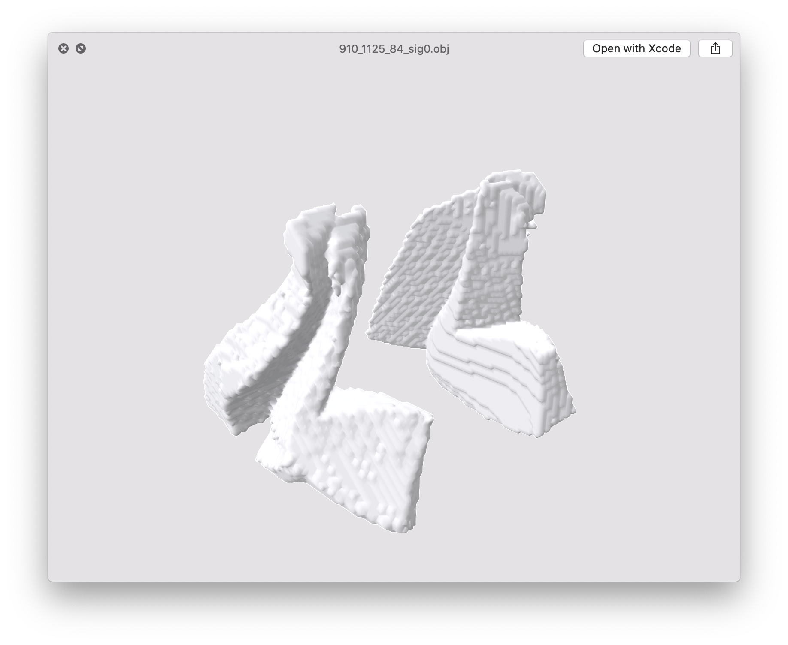

# nrrd2mesh
This package provides the capability to compute a mesh (in .OBJ format) from a raster volume (in .nrrd format), if this one contains labels or masked.  

Note that this will not perform well if the NRRD file contains floating point values.  

This is both a CLI and a library to be imported.

`nrrd2mesh` is using the [Lewiner](papers/lewiner.pdf) implementation of the Marching Cube algorithm in order to obtain smoother results.

## Install
```
pip install git+https://github.com/BlueBrain/bbp-nrrd2obj.git
```

## CLI arguments
The command `nrrd2obj` has the following usage:
```
-h, --help                 Show this help message and exit

  --version                Show program's version number and exit

  --nrrd FILE PATH         The volume file (input .nrrd)

  --obj FILE PATH          The mesh file (input .obj)

  --mask-values INTEGERS   The values of voxel to include in the output mesh.

  --decimation FLOAT       The ratio of original mesh vertices to conserve in 
                           [0,0, 1.0]. (default: no decimation)
                        
  --sigma-smooth FLOAT     The standard deviation of the gaussian kernel applied
                           for smoothing the mesh. The higher the smoother.
                           0 means no smoothing (default: 2)

  --reverse-winding        Reversing the winding will result in normal vectors pointing
                           the opposite direction (default: no reverse winding)
```

## Examples

### Smoothing the mesh
Even with using the Lewiner mesh computation, the raw meshes still have very similar edges to their voxel counterpart, hence it makes sense to smooth them, especially if the purpose of the mesh computation is mainly data visualisation.  
The smoothing consists in applying a 3D Gaussian blur to the raster volume before the mesh is even computed. The Gaussian kernel is computed using the optionally provided standard deviation argument `--sigma-smooth`. By default, the standard deviation is `2`.  

Here are some examples of smoothing:

| <div style="width:150px">`--sigma-smooth`</div> |             Result              |
|:-----------------------------------------------:|:-------------------------------:|
|                0 (no smoothing)                 |   |
|                        1                        |   |
|                        2                        |   |
|                        3                        |   |
|                        5                        |   |
|                       10                        |  |


### Decimating the mesh
The mesh being computed with the Lewiner method contains an unnecessarily high number of
vertices but, by default, `nrrd2obj` does not alter this. Though, it is advised to 
reduce the number of vertices using the option `--decimation` followed by the ratio of vertices to keep (in the range [0, 1]).  

The decimation done with the well proven method [Surface Simplification Using Quadric Error Metrics](papers/quadrics.pdf) that maintain very efficiently the shapes and curvatures of the mesh while making it drastically smaller.  

Here are some examples of decimations, performed from the same mesh computed with a smoothing standard deviation of `3`:

| <div style="width:120px">`--decimation`</div> | <div style="width:90px"># vertices</div> | <div style="width:100px">File size</div> | Result |
|:---------------------------------------------:|:------------------:|:---------:|:------:|
| (no decimation)      |   28572    |    1.8MB  |     |
| `0.25`      |   7143    |    436KB  |     |
| `0.1`      |   2857    |    174KB  |     |
| `0.05`      |   1428    |    85KB  |     |
| `0.01`      |   285    |    16KB  |     |
| `0.005`      |   142    |    8KB  |     |
| `0.001`      |   28    |    1KB  |     |

### Reverse winding
In some visualisation platforms, the order in which are saved the vertices of each triangle will impact whether the mesh is "as seen from inside" or "as seen from outside". For some mysterious reasons (that are not even made clear on the Scipy documentation, even though the effect is acknowledged) the meshing of some raster volume will lead to triangles being winded in one way and some other volumes are going to be encoded in the other way.  

`nrrd2obj` makes it possible to reverse the order using the `--reverse-winding` (not followed by any value).


## Funding & Acknowledgment

The development of this software was supported by funding to the Blue Brain Project, a 
research center of the École polytechnique fédérale de Lausanne (EPFL), from the Swiss 
government’s ETH Board of the Swiss Federal Institutes of Technology.

Copyright © 2022-2024 Blue Brain Project/EPFL